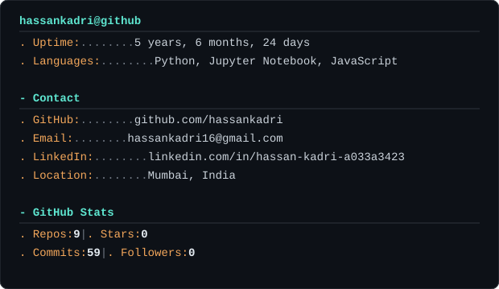

  

<table width="100%" border="1" cellspacing="0" cellpadding="0">
<tr>
<td bgcolor="#0d1117">
🔴 🟡 🟢 &nbsp; <b>hassankadri — profile</b>
</td>
</tr>
<tr>
<td bgcolor="#0d1117" align="center">
 

  

  
</td>
</tr>
</table>

 

  

> Motivated BCA graduate (2026) with hands-on experience in full-stack development, AI/ML pipelines, and building production-ready applications. Passionate about leveraging Large Language Models, vector databases, and data-driven solutions to solve real-world problems.
>
> Completed virtual industry simulations at **JPMorganChase**, **Deloitte**, and **BCG**.

 

<table width="100%" border="0">
<tr><td width="18%"><b>Languages</b></td><td>

</td></tr>
<tr><td><b>AI / ML</b></td><td>

</td></tr>
<tr><td><b>Web & Backend</b></td><td>

</td></tr>
<tr><td><b>Data & Tools</b></td><td>

</td></tr>
</table>

 

<b>🤖 Clawbit AI — Full-Stack AI Assistant</b>

 

`Next.js` `React` `TypeScript` `FastAPI` `LangGraph` `LangChain` `ChromaDB` `Gemini API`

- Full-stack AI assistant with real-time streaming, conversation memory, and a ChatGPT/Claude-inspired interface.
- RAG pipeline via LangChain + ChromaDB for contextual answers from PDF, DOCX, TXT, Markdown, CSV, and image uploads.
- FastAPI backend orchestrating multi-step AI workflows with LangGraph and Google Gemini, plus tool calling.
- Speech-to-text, syntax-highlighted Markdown rendering, retry/regenerate, and dynamic theming.

<b>🔍 AI RAG Document Query System</b>

 

`Python` `FastAPI` `Streamlit` `FAISS` `ChromaDB` `OpenAI Embeddings`

- RAG pipeline for PDF upload + AI-powered querying with vector search — cut answer time from minutes to under 5 seconds.
- Adaptive text chunking and embeddings over 100+ page documents, holding 85%+ retrieval accuracy.
- 4 FastAPI endpoints + a Streamlit UI for upload, indexing, querying, and session reset.

<b>🎬 BookMySeat — Full-Stack Movie Ticket Booking Platform</b>

 

`React.js` `Tailwind CSS` `Node.js` `Express.js` `MongoDB` `JWT` `Stripe API`

- Real-time seat selection, showtime management, and booking history across concurrent sessions.
- JWT-based auth with role-based access control, securing 100% of private API routes.
- Stripe payments with webhook verification and automated email confirmations.

<b>📚 Semantic Book Recommender</b>

 

`Python` `Sentence Transformers` `FAISS` `Pandas`

- NLP recommendation engine using semantic embeddings to suggest books by description similarity.
- Embedded 7,000+ book descriptions for vector-based nearest-neighbor search with category/sentiment filtering.

 

<table width="100%">
<tr>
<td width="26%" valign="top">
<b>JPMorganChase</b> 
Software Engineering Job Simulation 
<i>Forage · June 2026</i>
</td>
<td valign="top">Built a Spring Boot microservice with Kafka consumers and REST APIs, handling end-to-end transaction processing across 3 workflow stages.</td>
</tr>
<tr><td colspan="2">
</td></tr>
<tr>
<td valign="top">
<b>Deloitte Australia</b> 
Data Analytics Job Simulation 
<i>Forage · June 2026</i>
</td>
<td valign="top">Built Tableau dashboards tracking machine downtime across 4+ manufacturing facilities and cleaned 1,000+ workforce records for pay equity analysis.</td>
</tr>
<tr><td colspan="2">
</td></tr>
<tr>
<td valign="top">
<b>BCG GenAI</b> 
AI Job Simulation 
<i>Forage · June 2026</i>
</td>
<td valign="top">Built a rule-based financial chatbot in Python to analyze SEC 10-K filings and automate query handling.</td>
</tr>
</table>

 

**🎓 Bachelor of Computer Applications**
Atharva Institute of Information Technology, Mumbai · *July 2023 – June 2026*

 

🏅 Oracle Cloud Infrastructure 2025 AI Foundations Associate — *Aug 2025 – Oct 2025* 
🏅 Deloitte Australia Cyber Job Simulation (Forage) — *Dec 2025* 
🏅 Cyber Security Course Certification (YCMOU) — *Apr 2026*

 

 

  

 

<h3 align="center">🩻 MedVision</h3>

<i>Chest X-Ray → Deep Learning → Deployment</i>

<pre align="center">
main
 │
 ├── 📁 collect-dataset      ✔ merged
 │
 ├── 🧠 train-baseline       ✔ merged
 │
 ├── 📊 evaluate-metrics     ● in progress   [▓▓▓▓▓▓▓░░░] 72%
 │
 └── 🚀 deploy-production    ○ planned
</pre>

<code>TensorFlow</code> · <code>DVC</code> · <code>MLflow</code> · <code>Docker</code> · <code>Flask</code> · <code>CI/CD</code>

<i>Not just training a model — learning how to take it all the way to production.</i>

 

<b>Build it. Break it. Understand it. Build it better.</b>

<blockquote align="center">
<i>"The best way to predict the future is to invent it."</i>
 — Alan Kay
</blockquote>

 

---

